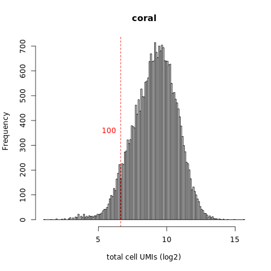
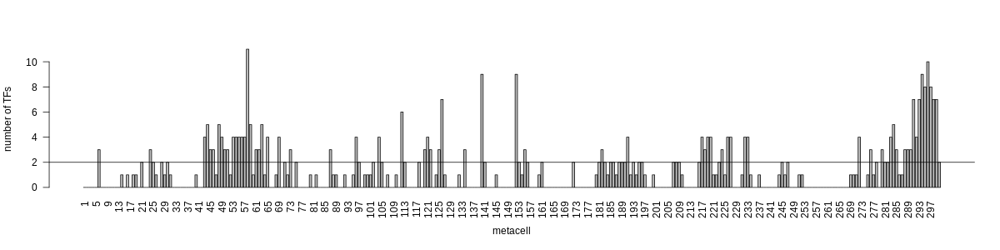
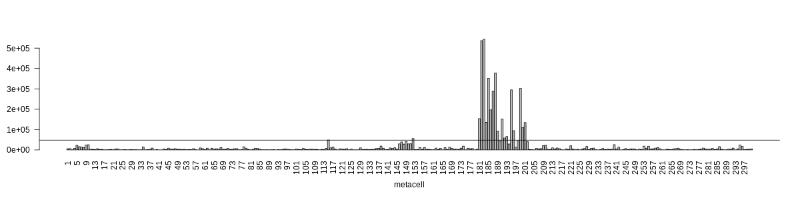
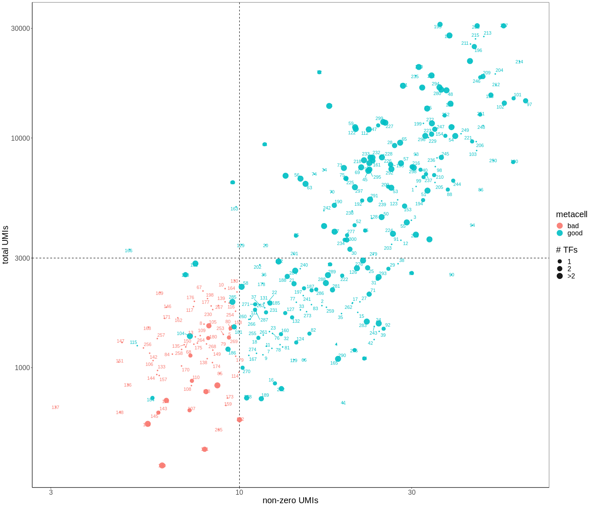

```{r options, include=FALSE}
knitr::opts_chunk$set(eval = FALSE, fig.align = 'center')
```

# Set up metacell analysis

Load required packages and functions.

```{r setup, eval=TRUE, message=FALSE, warning=FALSE}
library(data.table)
library(ggplot2)
library(ggrepel)
library(ggrastr)
library(plotly)
library(scales)
library(stringr)
library(RColorBrewer)
library(circlize)
library(tgconfig)
library(metacell)
theme_py <- theme_classic() + theme(
  panel.grid.major = element_blank(),
  panel.grid.minor = element_blank(),
  panel.border = element_rect(colour = "black", fill = NA),
  text = element_text(size=20)
)
theme_set(theme_py)
# load functions for downstream analysis
scripts <- list.files("metacell_downstream_functions",full.names=TRUE)
for (file in scripts) source(file)
```

Initialize database and figures output directory.

```{r mc_setup, eval=TRUE, warning=FALSE, message=FALSE}
require(metacell)

# analysis dir
cluster_dir <- "clustering_coral"
dir.create(cluster_dir, showWarnings=FALSE)

# initialize db directory
scdb_dir <- file.path(cluster_dir, "scdb")
dir.create(scdb_dir, showWarnings=FALSE)
scdb_init(scdb_dir, force_reinit=TRUE)

# plotting directory
scdb_fig_dir <- file.path(scdb_dir,"figs")
dir.create(scdb_fig_dir, showWarnings=FALSE)
scfigs_init(scdb_fig_dir)

# directory with annotations
annot_dir <- "annotation"
```

# Metacell piepline

## Input data filtering

Load the UMI counts table to metacell database.  

```{r mcell_import}
# import UMI table
mat_nm <- "coral"
mcell_import_multi_mars(
  mat_nm = mat_nm,
  dataset_table_fn = file.path(cluster_dir, "MARS_Batches_coral.txt"),
  base_dir = "umi.tab",
  force = TRUE
)
# load matrix from metacell db
mat <- scdb_mat(mat_nm)
```

Filter ERCCs, genes from contaminating symbiodinium scaffolds and partial scaffolds, as well as low UMI peaks (peaks here are extensions to existing gene models, i.e. high coverage peaks in genome close to gene bodies).

```{r mcell_filter_genes}
erccs <- rownames(mat@mat)[grepl("ERCC",rownames(mat@mat))] 
symbio_bl <- readLines(file.path(annot_dir,"Blacklist_genes_symbio_contamination"))
peaks_counts <- rowSums(as.matrix(mat@mat[grepl("peak_",rownames(mat@mat)),]))
peaks_ignore <- names(which(peaks_counts<100))
# ignore selected genes
mcell_mat_ignore_genes(new_mat_id = mat_nm, mat_id = mat_nm, ig_genes = c(erccs,symbio_bl,peaks_ignore))
# reload object from metacell db
mat <- scdb_mat(mat_nm)
```

Filter by cell depth (UMIs/cell).

```{r mcell_filter_cells}
# plot UMI distributions
x <- colSums(as.matrix(mat@mat))
mcell_plot_umis_per_cell(mat_id = mat_nm, min_umis_cutoff = 100)
# # filter out large and small cells
large_cells <- names(which(x>8000))
small_cells <- names(which(x<100))
#old_good_cells <- readLines("../clustering_coral/scdb/mc.mc_080420.cells.tsv")
#old_bad_cells <- setdiff(colnames(mat@mat),old_good_cells)
# save new matrix to metacell db
mat_nm_filt <- "coral_100"
mcell_mat_ignore_cells(new_mat_id = mat_nm_filt ,mat_id = mat_nm, ig_cells=c(small_cells,large_cells))
mat <- scdb_mat(mat_nm_filt)
```
```{r umi_plot, eval=TRUE, echo=FALSE, out.width=300px, fig.cap="Total UMI/cell distribution"}

```

Compute gene statistics.

```{r mcell_gstat}
mcell_add_gene_stat(gstat_id = "gstat", mat_id = mat_nm_filt, force = TRUE)
# reload matrix from metacell db
mat <- scdb_mat(mat_nm_filt)
```

## Building metacells

We need to select marker genes for building metacell graph. For this, we first blacklist top x% genes correlated to batch expression. We identified these genes by performing initial metacell analysis without  filtering genes for marker selection (code chunk at the end of this section).

Now we select marker genes for building metacells.

```{r mcell_markers}
# batch genes to blacklist
bl <- readLines(file.path(cluster_dir,"coral_bl_extended.txt"))
# marker genes for building metacells
mcell_gset_filter_multi(
  gstat_id = "gstat",
  gset_id = "clust_markers",
  T_tot = 30, T_top3 = 2, T_szcor = -0.05, T_niche = 0.01, 
  blacklist = bl, 
  force_new=TRUE
)
# selected 809 markers
# plot markers' statistics
mcell_plot_gstats(gstat_id = "gstat", gset_id = "clust_markers")
# get marker genes
marker_genes_gset <- scdb_gset(id="clust_markers")
marker_genes <- names(marker_genes_gset@gene_set)
```
```{r gstat_markers_plot eval=TRUE, echo=FALSE, out.width=300px, fig.cap="Gene statistics"}
knitr::include_graphics(c(
  "clustering_coral/scdb/figs/gstat.varmin.png",
  "clustering_coral/scdb/figs/gstat.szcor.png",
  "clustering_coral/scdb/figs/gstat.top3.png"
))
```

Building metacells.

```{r mcell_knn}
# build cell graph
mcell_add_cgraph_from_mat_bknn(
  mat_id = mat_nm_filt,
  gset_id = "clust_markers",
  graph_id = "graphk100", K = 100, dsamp=FALSE
)

# resample graph and compute metacells for each resampling
mcell_coclust_from_graph_resamp(
  coc_id = "coc1000_min20",
  graph_id = "graphk100",
  min_mc_size = 20, p_resamp = 0.75, n_resamp = 1000
)

# final graph and metacells from co-occurence in resampled graphs
mcell_mc_from_coclust_balanced(
  mc_id = "mc_k30",
  coc_id = "coc1000_min20",
  mat_id = mat_nm_filt,
  K = 30, min_mc_size = 20, alpha = 2
)
```

Identifying batch-correlated genes after the first round of clustering. After this, metacell building and clustering is repeated.

```{r}
# calculate the frequency of each batch in each metacell
m <- matrix(
  nrow=5, ncol=ncol(mc@mc_fp), unlist(tapply(
    mat@cell_metadata[names(mc@mc), "seq_batch_id"], mc@mc, function(x) table(x)
  ))
)
m_f <- t(apply(m, 1, function(x) x/colSums(m)))
# we essentially have two batches, israel-processed plates and barcelona-processed plates
# we will search for genes that are correlated with batches
g_cor <- cor(t(mc@mc_fp),colSums(m_f[1:2,]),method="spearman")
batchy <- union(names(which(g_cor[,1]>quantile(g_cor,0.98))), names(which(g_cor[,1]<quantile(g_cor,0.02))))
# we also add histones and ribosomal proteins
annot <- read.table(
  file.path(annot_dir,"Spis_annotation_v7_2020-10-26_clean"),
  header=TRUE, row.names=1, sep="\t", fill=TRUE, quote=""
)
histones <- rownames(annot[grepl("Histone/",annot[,1]),])
ribosomal_prots <- rownames(annot[grepl("Ribosomal.*/",annot[,1],perl=T),])
batchy <- unique(c(batchy,histones,ribosomal_prots))
write.table(batchy,"coral_bl_extended",quote=FALSE,col.names=FALSE,row.names=FALSE)
```

## Filtering out bad metacells

Reload counts matrix and metacell object from the datatbase.

```{r mcell_load_filt}
mat <- scdb_mat("coral_100")
mc <- scdb_mc("mc_k30")
mcs <- colnames(mc@mc_fp)
marker_genes_gset <- scdb_gset(id="clust_markers")
marker_genes <- names(marker_genes_gset@gene_set)
```

The following criteria are used for filtering out bad metacells:

* **number of genes with non-zero UMIs** summarized across all cells in metacell - metacells consisting of cells that express very low number of genes are potentially bad metacells

```{r nonzero_umi}
# count genes with non-zero UMIs in single cells
csums <- lapply(mcs, function(mcid) {
  mc_cells <- names(mc@mc[mc@mc==mcid])
  nonzerogenes <- Matrix::colSums(mat@mat[marker_genes,mc_cells]>0)
  data.table(non_zero_genes_per_cell = nonzerogenes)
})
csumsdt <- rbindlist(csums,idcol = "mc")
csumsdt[,mc:=factor(mc,levels=mcs)]
# summarize by taking the peak of distribution of non-zero UMI counts in the cells in each metacell
csumsdtmean <- csumsdt[,.SD[,.(
  non_zero_genes_peak={
    dns = density(non_zero_genes_per_cell)
    ind = which.max(dns$y)
    dns$x[ind]
})],mc]
```

* **total number of UMIs** summed across all cells in metacell - metacells consisting of very small cells, with a low UMI count, are potentially bed metacells.

```{r total_umi}
# count total UMIs in cells
umisums <- lapply(mcs, function(mcid) {
  mc_cells <- names(mc@mc[mc@mc==mcid])
  mc_table <- mat@mat[marker_genes,mc_cells]
  totalumis <- Matrix::colSums(mc_table)
  data.table(total_umis_per_cell = totalumis) # var_umis = varumis
})
umisumsdt <- rbindlist(umisums,idcol = "mc")
umisumsdt[,mc:=factor(mc,levels=mcs)]
# summarize by taking the sum of total UMIs in the cells in each metacell
umisumsdtsum <- umisumsdt[,.(total_umis=sum(total_umis_per_cell)),mc]
```

By combining the previous two criteria we identify a pool of potentially bad metacells as those with less than 10 genes with non-zero UMI counts and with total UMI count below 3000. 

```{r mc_filt_bad}
# combine the two metrics
dt <- csumsdtmean[umisumsdtsum,on="mc"]

# non-zero UMI genes threshold
nonzerothrs <- 10
dnonzeroumi <- density(dt$non_zero_genes_peak,adjust=0.35)
png(file.path(scdb_fig_dir,"mc_filt_nozero_umi.png"), width=1200, height=300)
plot(dnonzeroumi,main="non-zero UMIs"); abline(v=nonzerothrs)
dev.off()

# total UMI threshold
dumi <- density(dt$total_umis,adjust=0.35)
totumithrs <- 3000 

# plot
png(file.path(scdb_fig_dir,"mc_filt_tot_umi.png"), width=1200, height=300)
plot(dumi,main="total UMIs"); abline(v=totumithrs)
dev.off()
```
```{r mc_filt_tot_umi eval=TRUE, echo=FALSE}
knitr::include_graphics(c(
  "clustering_coral/scdb/figs/mc_filt_nozero_umi.png",
  "clustering_coral/scdb/figs/mc_filt_tot_umi.png"
))
```

As a final criteria, we retain those potentially bad metacells that express more than 2 known TFs with lfc > 2, and those that have a strong symbiodinium signal.

* **expression of known TFs**

```{r mc_filt_tf}
TFs_dt <- fread(file.path(annot_dir,"curated_TFh_Spis_EDITED_NAMES.csv"), header=FALSE)
# number of TFs expressed in bad metacells
tfs <- intersect(TFs_dt$V1,rownames(mc@mc_fp))
tfsmc <- apply(mc@mc_fp[tfs,],2,function(x) sum(x>2))
# plot
png(file.path(scdb_fig_dir,sprintf("mc_filt_num_tfs.png")),width=1200,height=300)
barplot(tfsmc,las=2,xlab="metacell",ylab="number of TFs")
tfthrs <- 2
abline(h=tfthrs)
dev.off()
```
```{r mc_filt_num_tfs, eval=TRUE, echo=FALSE}

```

* **symbiodinium signal**

```{r mc_filt_symb}
ss <- readRDS(file.path(cluster_dir,"Symbiodinium_uncleaned_signal.rds"))
# symbiodinium signal in bad metacells
ssmc <- tapply(ss,mc@mc[names(ss)],sum)
# plot
png(file.path(scdb_fig_dir,sprintf("mc_filtsymb_signal.png")),width=1200,height=300)
barplot(ssmc,las=2,xlab="metacell")
ssthrs <- 48e3
abline(h=ssthrs)
dev.off()
```
```{r mc_filtsymb_signal, eval=TRUE, echo=FALSE}

```

Thresholding metacells. 

```{r mc_filt_thrs_plot}
tfdt <- data.table(mc=names(tfsmc),num_TFs=tfsmc)
sdt <- data.table(mc=names(ssmc),symbio=ssmc)
dts <- dt[sdt,on="mc"]
dtt <- dts[tfdt,on="mc"]
# thresholding metacells
dtt[,status:="good"]
dtt[non_zero_genes_peak<nonzerothrs & total_umis<totumithrs, status:="bad"]
dtt[num_TFs>tfthrs & total_umis>1000, status:="good"]
dtt[symbio>ssthrs, status:="good"]
dtt[,num_TFs_scaled:=pmin(num_TFs,3)]
# plot
png(file.path(
  scdb_fig_dir, sprintf("mc_filt_%.0fnonzeroUMI_%.0ftotUMI_%sTFs.png", nonzerothrs, totumithrs, tfthrs)
),width=1400, height=1200)
ggplot(dtt,aes(non_zero_genes_peak,total_umis,label=mc,color=status)) + 
  geom_hline(yintercept=totumithrs, linetype="dashed") +  
  geom_vline(xintercept = nonzerothrs, linetype="dashed") +
  geom_point(aes(size=num_TFs_scaled),alpha=0.9) + scale_size(breaks=1:3,labels=c(1:2,">2"),name="# TFs") +
  geom_text_repel(show.legend=FALSE) + 
  scale_y_log10() + scale_x_log10() +
  labs(x="non-zero UMIs", y="total UMIs") +
  guides(colour=guide_legend(title="metacell",override.aes=list(size=6)))
dev.off()
```
```{r mc_filt, eval=TRUE, echo=FALSE}

```

Remove bad metacells.

```{r mc_kill}
kill_mcs <- dtt[status=="bad",mc]
mc <- mc_set_outlier_mc(mc,as.integer(kill_mcs))
mc <- mc_update_stats(mc, mat)
scdb_add_mc("mc_kill", mc)
```

## Add cell type annotations and reorder metacells

Metacells are assigned cell type annotations (and corresponding colors) by the expression of marker genes (see below).  
After killing bad metacells, the remaining metacells are re-labeled from 1 to n, so we need to modify metacell annotation accordingly.

```{r mc_kill_reord}
# read original annotations and update it after killing
ann_file <- file.path(scdb_dir,"Metacell_annotation_kill")
ann_orig <- fread(ann_file)[cell_type!="KILL"]
ann_kill <- ann_orig[order(metacell)][,metacell:=1:.N]
# reorder by cell type after killing
ann_kill[,cell_type:=factor(cell_type,levels=unique(ann_orig$cell_type))]
setorder(ann_kill,cell_type,metacell)
# update mc object
mc <- scdb_mc("mc_kill")
mc_reord <- mc_reorder(mc_col, as.integer(ann_kill$metacell))
mc_reord@colors <- ann_kill$color
# remove last group of bad metacells
mc_f <- mc_set_outlier_mc(mc_reord, which(ann_kill$cell_type=="KILL"))
mc_f <- mc_update_stats(mc_f, mat)
# save final annotaions
ann <- ann_kill[,cell_type:="KILL"][,metacell:=1:.N]
ann_final <- file.path(scdb_dir,"Metacell_annotation_kill_reord")
fwrite(ann, ann_final)
# add mc object to database
mc_f@colors=as.character(ann$color)
names(mc_f@colors)=as.character(ann$metacell)
scdb_add_mc("mc_kill_reord",mc_f)
```

By looking at gene expression profiles, it became clear that metacell 88, annotated as germline (sperm), was composed of two discrete groups of cells.

```{r}
mc_id <- "mc_kill_reord"
mat_id <- "coral_100"
mat <- scdb_mat(mat_id)
mc <- scdb_mc(mc_id)

# load pre-calculated  symbiodinium signal
symbio <- readRDS(file.path(cluster_dir,"symbio_signal.rds"))

# plot gene expression across all metacells
scp_plot_cmod_markers(
  mc_object = mc, mat_object = mat,
  clust_ord=niche_order, clust_col = niche_color,
  black_list = c(bl,grep("orphan",rownames(mc@mc_fp),value=TRUE)),
  output_file=file.path(scdb_fig_dir,sprintf("mc_split_gene_expression_%s",mc_id)),
  plot_format="png", width = 5500, height = 15000, plot_sc_width_cex = 5,
  #plot_format = "pdf", width = 80, height = 180, plot_sc_width_cex = 5,
  show_gene_names = TRUE, gene_font_size = 18, gene_chr_limit = 50,
  mc_font_size = 18, mc_label_cex = 0.6, clust_bars = ssmc,
  gene_annot_file=file.path(annot_dir,"Spis_annotation_v7_2020-10-26_clean"), 
  per_clust_genes=20, gene_min_fold=2, plot_sc=FALSE, print_heatmap=FALSE
)
```
```{r mc_split_gene_expression_mc_kill_reord, eval=TRUE, echo=FALSE}
knitr::include_graphics("clustering_coral/scdb/figs/mc_split_gene_expression_mc_kill_reord.png")
```

By inspecting the expression of marker genes, we saw that one group of cells in metacell 88 expressed germline markers, and the other contained symbiodinium signal. 

```{r}
# get cell names with and without symbiodinium
mc88_cells <- names(mc@mc[mc@mc=="88"])
mc88_cells_WITH <- names(which(symbio[mc88_cells]>100))
mc88_cells_NO <- names(which(symbio[mc88_cells]<=100))
# look at the expression of markers
par(mfrow=c(1,2))
png(file.path(cluster_dir,scdb_fig_dir,"mc_split_markers.png"), width=1000, height=500)
sperm_markers <- names(which(mc@mc_fp[,88]>3 & apply(mc@mc_fp[,80:87],1,max)<1.8))
sperm_markers_expression <- colSums(as.matrix(mat@mat[sperm_markers,c(mc88_cells_WITH,mc88_cells_NO)]))
plot(
  symbio[c(mc88_cells_WITH,mc88_cells_NO)], sperm_markers_expression,
  ylab="sperm markers expression",xlab="symbiodinium signal"
)
mitohost_marker <- names(which(rowMax(mc@mc_fp[,80:87])>3 & mc@mc_fp[,88]<1.8))
mitohost_marker_expression <- colSums(as.matrix(mat@mat[mitohost_marker,c(mc88_cells_WITH,mc88_cells_NO)]))
plot(
  symbio[c(mc88_cells_WITH,mc88_cells_NO)], mitohost_marker_expression,
  ylab="mitotic host cells markers expression",xlab="symbiodinium signal"
)
dev.off()
par(mfrow=c(1,1))
```
```{r mc_split_markers, eval=TRUE, echo=FALSE}
knitr::include_graphics("clustering_coral/scdb/figs/mc_split_markers.png")
```

We split this metacell, save the final object to the database, and update annotation accordingly.

```{r}
# create new metacell object and add it to database
new_mc_id <- "mc_coral"
new_mc <- mc@mc
new_mc[new_mc>88] <- new_mc[new_mc>88]+1
new_mc[mc88_cells_NO] <- 89
new_mc <- tgMCCov(new_mc, mc@outliers, mat)
new_mc@colors <- ann$color
scdb_add_mc(new_mc_id, new_mc)
# update annotations files
ann <- fread(file.path(scdb_dir,"Metacell_annotation_kill_reord"))
ann_final <- rbindlist(list(
  ann[1:87], 
  ann[88][,':='(cell_type="mitotic_host_cells",color="burlywood2")], 
  data.tble(metacell=89, cell_type="mitotic_host_cells", color="burlywood2"), 
  ann[89:nrow(ann)][,metacell:=metacell+1]
))
ann_final_file <- file.path(scdb_dir,"Spis_coral_metacell_annotation")
fwrite(ann_final, ann_final_file)
```

Look at the expression of mitotic host cells marker genes in the two new metacells.

```{r}
# plot the expression of mitotic host cells makers in the split metacells
scp_plot_cmod_markers(
  mc_object = new_mc, mat_object = mat,
  #clust_ord=niche_order, clust_col = niche_color,
  black_list = c(bl,grep("orphan",rownames(mc@mc_fp),value=TRUE)),
  output_file=file.path(scdb_fig_dir,sprintf("mc_split_%s_mc88-89_mitohostmarkers",new_mc_id)),
  sub_list_mc = c(88:89), gene_list = mitohost_marker,
  plot_format="png", width = 500, height = 1800, plot_sc_width_cex = 3,
  #plot_format = "pdf", width = 80, height = 180, plot_sc_width_cex = 5,
  show_gene_names = TRUE, gene_font_size = 12, gene_chr_limit = 50,
  mc_font_size = 12, mc_label_cex = 0.5,#clust_bars = ssmc,
  gene_annot_file=file.path(annot_dir,"Spis_annotation_v5_2020-08-07"), 
  per_clust_genes=20, gene_min_fold=2, plot_sc=TRUE, print_heatmap=FALSE
)
```
```{r mc_split_gene_expression_mc_kill_reord, eval=TRUE, echo=FALSE}
knitr::include_graphics("clustering_coral/scdb/figs/mc_split_mc_coral_mc88-89_mitohostmarkers.png")
```

# Save output files

We save metacell output files for the final clustering solution.

```{r mc_save}
mc_id <- "mc_coral"
mat_id <- "coral_100"
mc <- scdb_mc(mc_id)
mat <- scdb_mat(mat_id)

# gene expression table
write.table(
  mc@mc_fp, file=file.path(scdb_dir, "Spis_coral_metacell_gene_FC"), 
  sep="\t", quote=FALSE, row.names=TRUE, col.names=TRUE
)
saveRDS(mc@mc_fp, file=file.path(scdb_dir, "Spis_coral_metacell_gene_FC.RDS"))

# UMI counts table
mc_umis_list <- lapply(colnames(mc@mc_fp), function(x) {
  cells <- names(mc@mc)[mc@mc==x]
  Matrix::rowSums(mat@mat[,cells])
})
mc_umis <- do.call(cbind,mc_umis_list)
colnames(mc_umis) <- colnames(mc@mc_fp)

write.table(
  mc_umis, file=file.path(scdb_dir, "Spis_coral_metacell_UMI_counts"), 
  sep="\t", quote=FALSE, row.names=TRUE, col.names=TRUE
)
saveRDS(mc_umis, file=file.path(scdb_dir, "Spis_coral_metacell_UMI_counts.RDS"))

# UMI fractions table
mc_umifrac <- mc_umis/rep(colSums(mc_umis),each=nrow(mc_umis))
write.table(
  mc_umifrac, file=file.path(scdb_dir, "Spis_coral_metacell_UMI_fractions"), 
  sep="\t", quote=FALSE, row.names=TRUE, col.names=TRUE
)
saveRDS(mc_umifrac, file=file.path(scdb_dir, "Spis_coral_metacell_UMI_fractions.RDS"))

# cell assignments to metacells
cell_df <- data.table(
  cell = names(mc@mc),
  metacell = mc@mc
)
fwrite(cell_df, file=file.path(scdb_dir, "Spis_coral_metacell_assignments"), sep="\t")

# 2d data
mc2d_id <- sprintf("%s.2dproj",mc_id)
mc2d <- scdb_mc2d(id=mc2d_id)
saveRDS(mc2d, file=file.path(scdb_dir, "Spis_coral_mc2d.RDS"))

# single cell UMIs
saveRDS(mat@mat[,names(mc@mc)], file=file.path(scdb_dir, "Spis_coral_sc_UMI_counts.RDS"))
```

Save original input data for GEO in matrix format.

```{r saveMTX}
saveMTX <- function(obj, name) {
  dir.create(name, showWarnings=FALSE)
  Matrix::writeMM(obj, file.path(name,"matrix.mtx"))
  writeLines(rownames(obj),file.path(name,"genes"))
  writeLines(colnames(obj),file.path(name,"cells"))
}
saveMTX(mat@mat, "GEO/coral")
```

Save data for all stages.

```{r}
# all datasets UMI counts
mb <- rbindlist(lapply(c(
  "clustering_coral/MARS_Batches_coral.txt",
  "clustering_polyp/MARS_Batches_polyp.txt",
  "clustering_larva/MARS_Batches_larva.txt"
), fread))
fwrite(mb, "MARS_Batches.txt", sep="\t", col.names=TRUE)
mat_nm <- "coral_all_stages"
mcell_import_multi_mars(
  mat_nm = mat_nm,
  dataset_table_fn = "MARS_Batches.txt",
  base_dir = "umi.tab",
  force = TRUE
)
mat <- scdb_mat(mat_nm)
erccs <- rownames(mat@mat)[grepl("ERCC",rownames(mat@mat))] 
symbio_bl <- readLines(file.path(annot_dir,"Blacklist_genes_symbio_contamination"))
peaks_counts <- rowSums(as.matrix(mat@mat[grepl("peak_",rownames(mat@mat)),]))
peaks_ignore <- names(which(peaks_counts<100))
# ignore selected genes
mcell_mat_ignore_genes(new_mat_id = mat_nm, mat_id = mat_nm, ig_genes = c(erccs,symbio_bl,peaks_ignore))
# reload object from metacell db
mat <- scdb_mat(mat_nm)
saveRDS(mat@mat, file=file.path(scdb_dir, "Spis_all_stages_sc_UMI_counts.RDS"))
```

Save data for symbiodinium

```{r}
scdb_dir <- "clustering_coral/scdb"
scdb_init(scdb_dir, force=TRUE)
mat_nm <- "symbio"
mat <- scdb_mat(mat_nm)
erccs <- rownames(mat@mat)[grepl("ERCC",rownames(mat@mat))] 
symbio_bl <- readLines(file.path(annot_dir,"Blacklist_genes_symbio_contamination"))
peaks_counts <- rowSums(as.matrix(mat@mat[grepl("peak_",rownames(mat@mat)),]))
peaks_ignore <- names(which(peaks_counts<100))
# ignore selected genes
mcell_mat_ignore_genes(new_mat_id = mat_nm, mat_id = mat_nm, ig_genes = c(erccs,symbio_bl,peaks_ignore))
# save mtx
saveMTX(mat@mat, "GEO/symbiodinium")
```

# Metacell visualizations

Load objects from the database.

```{r eval=TRUE}
mc_id <- "mc_coral"
mat_id <- "coral_100"
mat <- scdb_mat(mat_id)
mc <- scdb_mc(mc_id)
# blacklisted genes
bl <- readLines(file.path(cluster_dir,"coral_bl_extended.txt"))
# metacell annotations
ann <- fread(file.path(scdb_dir,"Spis_coral_metacell_annotation"))
setnames(ann,c("metacell","cell_type","color"))
niche_order <- as.character(ann$metacell)
niche_color <- ann$color
mccol <- structure(ann$color, names=ann$metacell)
```

Calculate scRNA-seq statistics that will be used for plotting, and save to database.

```{r}
# cell sizes
cell_sizes <- apply(mat@mat,2,sum)
cdt <- data.table(cells=colnames(mat@mat),cell_sizes=cell_sizes)
cdt[data.table(cells=names(mc@mc),metacells=mc@mc), on="cells", mc:=i.metacells]
cdt <- cdt[!is.na(mc)]
cdt[,median_mc_cell_size:=median(cell_sizes),mc]
cdt[,mc:=factor(mc,levels=sort(as.integer(unique(cdt$mc))))]
cdt[,total_mc_umis:=sum(cell_sizes),mc]
cdt[,total_mc_cells:=.N,mc]
fwrite(cdt,file.path(scdb_dir,"cdt.tsv"),sep="\t")
# gene stats
gstat_id <- "gstat"
gstat <- scdb_gstat(gstat_id)
gset_id <- "clust_markers"
marker_genes_gset <- scdb_gset(gset_id)
markers <- names(marker_genes_gset@gene_set)
gstat <- setDT(gstat)
setnames(gstat,"name","gene")
gstat[, marker:="no"]
gstat[gene %in% markers, marker:="yes"]
gstat[,log2_ds_mean:=log2(ds_mean)]
fwrite(gstat,file.path(scdb_dir,"gstat.tsv"),sep="\t")
# markers in cells
markers_mat <- mat@mat[markers,cdt$cells]
markers_num <- apply(markers_mat, 2, function(x) sum(x>0))
mdf <- cbind.data.frame(num_markers=markers_num)
fwrite(mdf,file.path(scdb_dir,"mdf.tsv"),sep="\t")
```

Save cell type color annotations used through the paper.

```{r}
annct <- unique(ann[,.(cell_type,color)])
ctcol <- annct$color
names(ctcol) <- annct$cell_type

ct_legend_height <- length(ctcol) * 0.5
ct_legend_width <- 6

pdf(
  file.path(scdb_fig_dir,"ct_pallete.pdf"), 
  width=ct_legend_width, height=ct_legend_height, useDingbats=TRUE
)
plot(NULL,xaxt='n',yaxt='n',bty='n',ylab='',xlab='',xlim=0:1, ylim=0:1)
legend(
  "topleft",legend=names(ctcol),col=ctcol, 
  bty = 'n', pch=15, pt.cex=3, cex=1.5, horiz=FALSE
)
dev.off()
```

## Plot atlas statistics

* cell size distribution histograms

```{r eval=TRUE}
cdt <- fread(file.path(scdb_dir,"cdt.tsv"))
cdt[,mc:=factor(mc,levels=sort(as.integer(unique(cdt$mc))))]
gp1 <- ggplot(cdt,aes(cell_sizes)) + 
  geom_histogram(color="white") + 
  scale_y_continuous(expand=c(0,0)) + 
  scale_x_log10(expand=c(0,0)) + 
  labs(x="N molecules", y="N cells") +
  theme(aspect.ratio = 1, axis.text.y = element_text(angle = 90, hjust = 0.5))
gp1
```

* gene total UMI histogram

```{r eval=TRUE}
gstat <- fread(file.path(scdb_dir,"gstat.tsv"))
gp2 <- ggplot(gstat,aes(tot)) + 
  geom_histogram(color="white") + 
  scale_y_continuous(expand=c(0,0), breaks=c(0,2000,4000)) + 
  scale_x_log10(expand=c(0,0), breaks=c(10,1000,100000), labels=c(10,1000,100000)) + 
  labs(x="N molecules", y="N genes") +
  theme(aspect.ratio = 1, axis.text.y = element_text(angle = 90, hjust = 0.5))
gp2
```

* cell sizes per metacell 

```{r eval=TRUE}
gp3 <- ggplot(cdt[!is.na(mc)],aes(mc,cell_sizes,group=mc,fill=mc)) + 
  geom_boxplot(outlier.alpha=0.2,outlier.size=2) +
  scale_y_log10(expand=c(0,0)) + 
  scale_fill_manual(values=mccol) +
  labs(x="metacells", y="N molecules per cell") +
  theme(
    axis.text.y = element_text(angle = 90, hjust = 0.5), 
    axis.ticks.x=element_blank(), axis.text.x=element_blank(), 
    legend.position="none"
  )
gp3
```

* marker gene selection (sz_cor vs total umis)

```{r eval=TRUE}
gp4 <- ggplot(gstat, aes(log2_ds_mean,sz_cor,color=marker)) +
  ggrastr::geom_point_rast(raster.dpi=72, alpha=0.8) +
  rasterise(geom_point(), dpi = 72) + 
  scale_color_manual(labels=c("other","marker"), values=c("black","purple3")) +
  labs(x="log2 mean UMIs", y="gene cell-size correlation") +
  theme(
    aspect.ratio = 1,
    legend.position = c(0.25, 0.95), legend.margin = margin(0.1,0.1,0.1,0.1),
    legend.justification = c("right", "top"), legend.box.just = "right",
    legend.title = element_blank(), legend.text = element_text(size=10)
  )
gp4
```

* fraction cells vs N markers seen

```{r eval=TRUE}
mdf <- fread(file.path(scdb_dir,"mdf.tsv"))
gp5 <- ggplot(mdf, aes(num_markers)) +
  stat_ecdf(geom = "step", pad = TRUE) +
  labs(x="N markers seen",y="Fraction of cells") +
  theme(aspect.ratio = 1)
gp5
```

* total number UMIs per metacell

```{r eval=TRUE}
cdt_mc_sum <- unique(cdt[,.(mc,total_mc_umis)])
gp6 <- ggplot(cdt_mc_sum,aes(mc,total_mc_umis,fill=mc)) + 
  geom_bar(stat="identity", color="black") +
  labs(x="metacells",y="total UMIs") +
  scale_y_log10(expand=c(0,0)) + 
  scale_fill_manual(values=mccol) +
  theme(
    axis.text.y = element_text(angle = 90, hjust = 0.5), 
    axis.ticks.x=element_blank(), axis.text.x=element_blank(), 
    legend.position="none"
  )
gp6
```

* total number of cells per metacell

```{r eval=TRUE}
cdt_cell_sum <- unique(cdt[,.(mc,total_mc_cells)])
gp7 <- ggplot(cdt_cell_sum,aes(mc,total_mc_cells,fill=mc)) + 
  geom_bar(stat="identity", color="black") +
  labs(x="metacells",y="total cells") +
  scale_y_continuous(expand=c(0,0), labels=scales::label_number_si()) + 
  scale_fill_manual(values=mccol) +
  theme(
    axis.text.y = element_text(angle = 90, hjust = 0.5), 
    axis.ticks.x=element_blank(), axis.text.x=element_blank(), 
    legend.position="none"
  )
gp7
```

Save atlas statistics plots to database.

```{r}
pdf(file.path(scdb_fig_dir,sprintf("atlas_stats_%s.pdf",mc_id)), width=18, height=9, useDingbats=TRUE)
egg::ggarrange(
  gp1, gp2, gp4, gp5,
  nrow=2, ncol=4
)
egg::ggarrange(
  gp3, gp6, gp7,
  nrow=3, ncol=1
)
dev.off()
```

Save metacell confusion matrix to database.

```{r}
confu <- mc_compute_norm_confu_matrix(mc_id, "graphk100")
hc_confu <- mc_confusion_clustering(confu,clust_method="average")
# save confusion matrix to database
saveRDS(hc_confu, file.path(scdb_dir, sprintf("confclust.%s_%s.RDS",mc_id,"graphk100")))
# saveplot as pdf file to disk
mcell_mc_plot_confusion_mas(
  mc_id, "graphk100", 
  use_orig_order = TRUE, mc_order = NULL,
  plot_format = "pdf", w=24, h=24,
  fig_fn = file.path(scdb_fig_dir,"mc.confusion.raster.pdf")
)
```

## Gene expression maps

2D graph projection of metacells

```{r mc_2d_proj}
# pdf
tgconfig::override_params(file.path(scdb_dir,"spis_metacell_params_fig.yaml"),"metacell")
mcell_mc2d_force_knn(
  mc2d_id = sprintf("%s.2dproj",mc_id),
  mc_id = mc_id,
  graph_id = "graphk100"
)
mcell_mc2d_plot_mas(
  mc2d_id=sprintf("%s.2dproj",mc_id),
  sc_alpha=0.4, sc_cex=0.4,
  show_mc=FALSE, show_mcid=FALSE, plot_edges=FALSE,
  fn_suf="Spis_coral2", plot_format="pdf"
)
mcell_mc2d_plot_mas(
  mc2d_id=sprintf("%s.2dproj",mc_id),
  sc_alpha=0.2, sc_cex=1.2,
  show_mc=FALSE, show_mcid=FALSE, plot_edges=FALSE,
  fn_suf="Spis_coral3", plot_format="pdf", raster=TRUE
)
# png
tgconfig::set_param("mcell_mc2d_width",1600,"metacell")
tgconfig::set_param("mcell_mc2d_height",1600,"metacell")
tgconfig::set_param("mcell_mc2d_cex",2,"metacell")
mcell_mc2d_plot_mas(
  mc2d_id=sprintf("%s.2dproj",mc_id),
  sc_alpha=1, sc_cex=0.6, 
  show_mc=TRUE, show_mcid=TRUE, plot_edges=TRUE,
  fn_suf="Spis_coral", plot_format="png"
)
```

Gene expression heatmaps

```{r metacell_expression_heatmap}
# load pre-calculated symbiodinium signal to plot on op of expression heatmap
ss <- readRDS(file.path(cluster_dir,"symbio_signal.rds"))
ssmc <- as.integer(tapply(ss,mc@mc[names(ss)],sum))
names(ssmc) <- colnames(mc@mc_fp)
ssmc <- ssmc[niche_order]

# select top genes to highlight
tfs <- fread(file.path(annot_dir,"curated_TFh_Spis_EDITED_NAMES.csv"))[[1]]
mc_fp <- mc@mc_fp[grep("orphan|LOC",rownames(mc@mc_fp),invert=TRUE),]
vargenes <- apply(mc_fp, 2, function(x) {
  genes <- rownames(mc_fp)[order(x,decreasing=TRUE)][1:10]
  top_genes <- genes[1:2]
  tfs <- genes %in% tfs
  if (sum(tfs)>0) {
    top_genes <- unique(c(genes[tfs],top_genes))
  }
  top_genes 
})
top_genes <- unique(unlist(vargenes,use.names=FALSE))

# save detailed heatmap as pdf file
hms <- scp_plot_cmod_markers(
  mc_object = mc, mat_object = mat,
  clust_ord=niche_order, clust_col=niche_color,
  black_list = c(bl,grep("orphan",rownames(mc@mc_fp),value=TRUE)),
  highlight_genes = top_genes,
  output_file=file.path(scdb_fig_dir,sprintf("Spis_coral_gene_expression")),
  plot_format = "pdf", width = 38, height = 44, plot_sc_width_cex = 1,
  show_gene_names = TRUE, gene_font_size = 24, gene_chr_limit = 25,
  show_mc_names = FALSE, mc_font_size = 10, mc_label_cex = 0.6, clust_bars = ssmc,
  clust_anno_size = unit(5,"mm"),
  gene_annot_file=file.path(annot_dir,"Spis_annotation_v7_2020-10-26_clean"), 
  tfs_annot_file=file.path(annot_dir,"curated_TFh_Spis_EDITED_NAMES.csv"), 
  per_clust_genes=10, gene_min_fold=2, smoothen=5, 
  max_expression_fc=5, max_expression_fc_sc=5,
  plot_sc=TRUE, print_heatmap=FALSE
)
```

# Cell type level metacell analysis

Summarize metacells across cell types, and add to the database.

```{r ct_mc}
mc_id <- "mc_coral"
mat_id <- "coral_100"
mat <- scdb_mat(mat_id)
mc <- scdb_mc(mc_id)
ann_file <- file.path(scdb_dir,"Spis_coral_metacell_annotation")
ann <- fread(ann_file)

# calculate mc object with mc_fp by cell type
mc_ct <- sca_cell_type_fp(
  input_table = ann_file,
  mc_object = mc,
  mat_object = mat
)
scdb_add_mc(id="ct_coral",mc_ct)

# save footprint
write.table(
  mc_ct@mc_fp, file=file.path(scdb_dir, "Spis_coral_cell_type_gene_FC"), 
  sep="\t", quote=FALSE, row.names=TRUE, col.names=TRUE
)
# save mock ann
ann[,metacell:=cell_type]
fwrite(unique(ann),file.path(scdb_dir,"Spis_coral_cell_type_annotation"),sep="\t")

# counts
ct_umis_list <- lapply(colnames(mc_ct@mc_fp), function(y) {
  x <- ann[cell_type==y,]$metacell
  cells <- names(mc_ct@mc)[mc_ct@mc%in%x]
  Matrix::rowSums(mat@mat[,cells])
})
ct_umis <- do.call(cbind,ct_umis_list)
colnames(ct_umis) <- colnames(mc_ct@mc_fp)
ct_umifrac <- ct_umis/rep(colSums(ct_umis),each=nrow(ct_umis))

write.table(
  ct_umis, file=file.path(scdb_dir, "Spis_coral_cell_type_UMI_counts"), 
  sep="\t", quote=FALSE, row.names=TRUE, col.names=TRUE
)
write.table(
  ct_umifrac, file=file.path(scdb_dir, "Spis_coral_cell_type_UMI_fractions"), 
  sep="\t", quote=FALSE, row.names=TRUE, col.names=TRUE
)

cell_df <- data.table(
  cell = mc_ct@cell_names[!(mc_ct@cell_names %in% mc@outliers)],
  cell_type = mc_ct@mc
)
fwrite(cell_df, file=file.path(scdb_dir, "Spis_coral_cell_type_assignments"), sep="\t")

```

# Broad cell type level metacell analysis

Group  cell types into broad cell types, and add to the database.

```{r bct_mc}
mc_id <- "ct_coral"
mat_id <- "coral_100"
mat <- scdb_mat(mat_id)
mc <- scdb_mc(mc_id)
ann_file <- file.path(scdb_dir,"Spis_coral_broad_cell_type_annotation")
ann <- fread(ann_file)

# calculate mc object with mc_fp by cell type
mc_ct <- sca_cell_type_fp(
  input_table = ann_file,
  mc_object = mc,
  mat_object = mat
)
scdb_add_mc(id="bct_coral",mc_ct)

# save footprint
write.table(
  mc_ct@mc_fp, file=file.path(scdb_dir, "Spis_coral_broad_cell_type_gene_FC"), 
  sep="\t", quote=FALSE, row.names=TRUE, col.names=TRUE
)

# counts
ct_umis_list <- lapply(colnames(mc_ct@mc_fp), function(y) {
  x <- ann[cell_type==y,]$metacell
  cells <- names(mc_ct@mc)[mc_ct@mc%in%x]
  Matrix::rowSums(mat@mat[,cells])
})
ct_umis <- do.call(cbind,ct_umis_list)
colnames(ct_umis) <- colnames(mc_ct@mc_fp)
ct_umifrac <- ct_umis/rep(colSums(ct_umis),each=nrow(ct_umis))

write.table(
  ct_umis, file=file.path(scdb_dir, "Spis_coral_broad_cell_type_UMI_counts"), 
  sep="\t", quote=FALSE, row.names=TRUE, col.names=TRUE
)
write.table(
  ct_umifrac, file=file.path(scdb_dir, "Spis_coral_broad_cell_type_UMI_fractions"), 
  sep="\t", quote=FALSE, row.names=TRUE, col.names=TRUE
)

cell_df <- data.table(
  cell = mc_ct@cell_names[!(mc_ct@cell_names %in% mc@outliers)],
  cell_type = mc_ct@mc
)
fwrite(cell_df, file=file.path(scdb_dir, "Spis_coral_broad_cell_type_assignments"), sep="\t")

```

# Sequencing statistics

Sequencing statistics from Indrops QC

```{r}
scdb_dir <- "clustering_coral/scdb"
# mc annots
cells_final <- unlist(lapply(
  c("coral","polyp","larva"), function(dir) {
    x <- switch(dir, coral="adult", dir)
    fread(file.path(sprintf("clustering_%s",dir),"scdb",sprintf("Spis_%s_metacell_assignments",x)))[[1]]
  }
), use.names = FALSE)
# QC directories
basedir <- "/users/asebe/asebe/proj/scRNAseq_coral/scdb_v3"
ds <- grep("DS",list.files(file.path(basedir,"Downsampling_reads")),value=TRUE)
wdirs <- c(
  "/users/asebe/asebe/proj/scRNAseq_coral/scdb_v2/", basedir, 
  file.path(basedir,"Downsampling_reads",ds)
)
names(wdirs) <- c("ORIGINAL","ALL",ds)
anndirs <- c("/users/asebe/asebe/proj/scRNAseq_coral/scdb_v2",rep(basedir,11))
names(anndirs) <- names(wdirs)
csdt <- rbindlist(lapply(names(wdirs), function(x) {
  message(sprintf("%s (%s/%s)",x,match(x,names(wdirs)),length(wdirs)))
  wdir <- wdirs[x]
  anndir <- anndirs[x]
  # sequencing annots
  wells_cells <- fread(file.path(anndir,"annotations/wells_cells.txt"))
  batch_table <- fread(file.path(anndir,"annotations/amp_batches.txt"))
  # UMIs per cell
  umi_files=list.files(file.path(wdir,"output/umi.tab"),pattern="*.txt",full.names=T)
  cell_Tumis <- unlist(lapply(umi_files, function(f) { 
    ff=read.table(f, header=TRUE, row.names=1, quote="", sep="\t")
    colSums(as.matrix(ff))
  }))
  cell_Tumis <- as.data.table(cell_Tumis,keep.rownames="well_id")[well_id %in% cells_final]
  # mapping stats per cell
  files=list.files(file.path(wdir,"output/QC/read_stats"),pattern="*.txt",full.names=T)
  cell_stats <- rbindlist(lapply(files, fread))
  cell_stats <- cell_stats[well_id %in% wells_cells$Well_ID]
  cols <- c("mapped_to_nongenic", grep("gene",colnames(cell_stats),value=TRUE))
  other_mapped <- rowSums(cell_stats[,..cols])
  cell_stats[,total_mapped:=cell_stats$gene_mapped+other_mapped]
  fcols <- c("well_id", "total","total_mapped","gene_mapped")
  cell_Treads <- cell_stats[well_id %in% cells_final,..fcols]
  dt <- merge.data.table(cell_Tumis,cell_Treads,by="well_id")
  dt[,cells_reads_umi:=total_mapped/cell_Tumis]
  setnames(dt,
    c("well_id","cell_Tumis","total","total_mapped","cells_reads_umi"),
    c("cell","UMI_per_cell","total_reads_per_cell","mapped_reads_per_cell","mapped_reads_per_UMI")
  )
  dt[,sample:=x]
  fwrite(dt,file.path(scdb_dir,sprintf("stats_cells_%s.tsv",x)),sep='\t')
  dt
}))
csdt <- rbindlist(lapply(
  list.files("clustering_coral/scdb",pattern="stats_cells",full.names=TRUE)[1:12], 
  function(x) {fread(x)}
))
fwrite(csdt,file.path(scdb_dir,"stats_cells.tsv"),sep='\t')
dtmed <- csdt[,lapply(.SD, median),sample,.SDcols=colnames(csdt)[-c(1,7)]]
dtcells <- csdt[,.(cells=.N),sample]
dt <- merge.data.table(dtmed,dtcells,by="sample")
dt[,dataset:=sprintf("Spis%s",sample)][,sample:=NULL]
setcolorder(dt,c("dataset","cells"))
fwrite(dt,file.path(scdb_dir,"stats.tsv"),sep='\t')
```

# Session info

```{r session, eval=TRUE}
sessionInfo()
```


