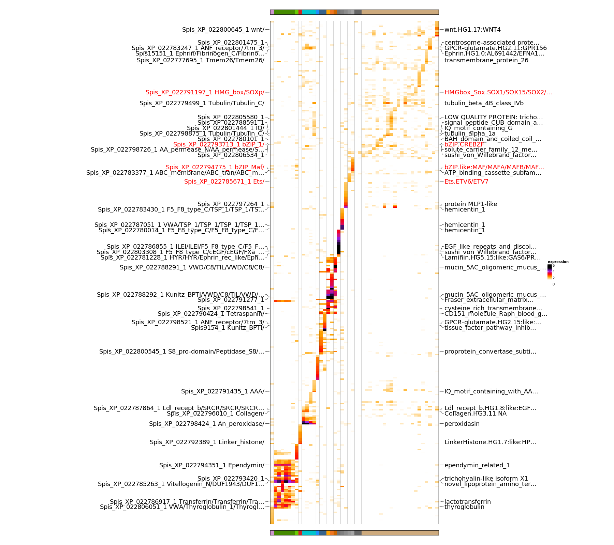

```{r options, include=FALSE}
knitr::opts_chunk$set(eval = FALSE)
```

# Set up metacell analysis

Load required packages and functions.

```{r setup, eval=TRUE, message=FALSE, warning=FALSE}
library(data.table)
library(ggplot2)
library(ggrepel)
library(ggrastr)
library(plotly)
library(scales)
library(stringr)
library(RColorBrewer)
library(circlize)
library(tgconfig)
library(metacell)
theme_py <- theme_classic() + theme(
  panel.grid.major = element_blank(),
  panel.grid.minor = element_blank(),
  panel.border = element_rect(colour = "black", fill = NA),
  text = element_text(size=20)
)
theme_set(theme_py)
# load functions for downstream analysis
scripts <- list.files("metacell_downstream_functions",full.names=TRUE)
for (file in scripts) 
  source(file)
```

Initialize database and figures' output directory.

```{r mc_setup, eval=TRUE, warning=FALSE, message=FALSE}
require(metacell)

# analysis dir
cluster_dir <- "clustering_larva"
dir.create(cluster_dir, showWarnings=FALSE)

# initialize db directory
scdb_dir <- file.path(cluster_dir, "scdb")
dir.create(scdb_dir, showWarnings=FALSE)
scdb_init(scdb_dir, force_reinit=TRUE)

# plotting directory
scdb_fig_dir <- file.path(scdb_dir,"figs")
dir.create(scdb_fig_dir, showWarnings=FALSE)
scfigs_init(scdb_fig_dir)

# directory with annotations
annot_dir <- "annotation"
```

# Metacell piepline

## Input data filtering

Load the expression data to metacell database.  

```{r mcell_import}
# import UMI table
mat_nm <- "larva"
mcell_import_multi_mars(
  mat_nm = mat_nm,
  dataset_table_fn = file.path(cluster_dir, "MARS_Batches_larva.txt"),
  base_dir = "umi.tab",
  force = TRUE
)
# load matrix from metacell db
mat <- scdb_mat(mat_nm)
```

Filter ERCCs, genes from contaminating symbiodinium scaffolds and partial scaffolds, as well as low UMI peaks (peaks here are extensions to existing gene models, i.e. high coverage peaks in genome close to gene bodies).

```{r mcell_filter_genes} 
erccs <- rownames(mat@mat)[grepl("ERCC",rownames(mat@mat))] 
symbio_bl <- readLines(file.path(annot_dir,"Blacklist_genes_symbio_contamination"))
peaks_counts <- rowSums(as.matrix(mat@mat[grepl("peak_",rownames(mat@mat)),]))
peaks_ignore <- names(which(peaks_counts<100))
# ignore selected genes
mcell_mat_ignore_genes(new_mat_id = mat_nm, mat_id = mat_nm, ig_genes = c(erccs,symbio_bl,peaks_ignore))
# reload object from metacell db
mat <- scdb_mat(mat_nm)
```

Filter by cell depth (UMIs/cell).

```{r mcell_filter}
# plot UMI distributions
x <- colSums(as.matrix(mat@mat))
mcell_plot_umis_per_cell(mat_id = mat_nm, min_umis_cutoff = 200)
# filter out large and small cells
large_cells <- names(which(x>8000))
small_cells <- names(which(x<200))
# save new matrix to metacell db
mat_nm_filt <- "larva_200"
mcell_mat_ignore_cells(new_mat_id = mat_nm_filt ,mat_id = mat_nm, ig_cells=c(small_cells,large_cells))
mat <- scdb_mat(mat_nm_filt)
```
```{r umi_plot, eval=TRUE, echo=FALSE}

```

Compute gene statistics.

```{r mcell_gstat}
mcell_add_gene_stat(gstat_id = "gstat", mat_id = mat_nm_filt, force = TRUE)
mcell_plot_gstats(gstat_id = "gstat")
# reload matrix from metacell db
mat <- scdb_mat(mat_nm_filt)
```
```{r gstat_plot eval=TRUE, echo=FALSE}
knitr::include_graphics(c(
  "clustering_larva/scdb/figs/gstat.varmin.png",
  "clustering_larva/scdb/figs/gstat.szcor.png",
  "clustering_larva/scdb/figs/gstat.top3.png"
))
```

## Building metacells

Select marker genes for building metacell graph.  

```{r mcell_markers}
# marker genes for building metacells
mcell_gset_filter_multi(
  gstat_id = "gstat",
  gset_id = "clust_markers",
  T_tot = 30, T_top3 = 2, T_szcor = -0.05, T_niche = 0.01, 
  force_new=TRUE
)
# plot genes' statistics
mcell_plot_gstats(gstat_id = "gstat", gset_id = "clust_markers")
# get marker genes
marker_genes_gset <- scdb_gset(id="clust_markers")
marker_genes <- names(marker_genes_gset@gene_set)
```

Building metacells

```{r mcell_knn}
# build cell graph
mcell_add_cgraph_from_mat_bknn(
  mat_id = mat_nm_filt,
  gset_id = "clust_markers",
  graph_id = "graphk100", K = 100, dsamp=FALSE
)

# resample graph and compute metacells for each resampling
mcell_coclust_from_graph_resamp(
  coc_id = "coc1000_min8",
  graph_id = "graphk100",
  min_mc_size = 8, p_resamp = 0.75, n_resamp = 1000
)

# final graph and metacells from co-occurence in resampled graphs
mcell_mc_from_coclust_balanced(
  mc_id = "mc_k30",
  coc_id = "coc1000_min8",
  mat_id = mat_nm_filt,
  K = 30, min_mc_size = 10, alpha = 2
)

# load metacell object from db and assign initial colours
mc <- scdb_mc("mc_k30")
```

## Filtering bad metacells

```{r mcell_load_filt}
mc_id <- "mc_k30"
mat_id <- "larva_200"
mat <- scdb_mat(mat_id)
mc <- scdb_mc(mc_id)
mcs <- colnames(mc@mc_fp)
marker_genes_gset <- scdb_gset(id="clust_markers")
marker_genes <- names(marker_genes_gset@gene_set)
```

The following criteria are used for filtering out bad metacells:

* **number of genes with non-zero UMIs** summarized across all cells in metacell - metacells consisting of cells that express very low number of genes are potentially bad metacells

```{r nonzero_umi}
# count genes with non-zero UMIs in single cells
csums <- lapply(mcs, function(mcid) {
  mc_cells <- names(mc@mc[mc@mc==mcid])
  mc_cells <- intersect(mc_cells,colnames(mat@mat))
  nonzerogenes <- Matrix::colSums(mat@mat[marker_genes,mc_cells]>0)
  data.table(non_zero_genes_per_cell = nonzerogenes)
})
csumsdt <- rbindlist(csums,idcol = "mc")
csumsdt[,mc:=factor(mc,levels=mcs)]
# summarize by taking the peak of distribution of non-zero UMI counts in the cells in each metacell
csumsdtmean <- csumsdt[,.SD[,.(
  non_zero_genes_peak={
    dns = density(non_zero_genes_per_cell)
    ind = which.max(dns$y)
    dns$x[ind]
})],mc]
```

* **total number of UMIs** summed across all cells in metacell - metacells consisting of very small cells, with a low UMI count, are potentially bed metacells.

```{r total_umi}
# count total UMIs in cells
umisums <- lapply(mcs, function(mcid) {
  mc_cells <- names(mc@mc[mc@mc==mcid])
  mc_cells <- intersect(mc_cells,colnames(mat@mat))
  mc_table <- mat@mat[marker_genes,mc_cells]
  totalumis <- Matrix::colSums(mc_table)
  data.table(total_umis_per_cell = totalumis)
})
umisumsdt <- rbindlist(umisums,idcol = "mc")
umisumsdt[,mc:=factor(mc,levels=mcs)]
# summarize by taking the sum of total UMIs in the cells in each metacell
umisumsdtsum <- umisumsdt[,.(total_umis=sum(total_umis_per_cell)),mc]
```

By combining the previous criteria we identify a pool of potentially bad metacells as those with <25 non-zero UMI counts and total UMI counts below 3000. 

```{r mc_filt_bad}
# combine the metrics
dt <- csumsdtmean[umisumsdtsum,on="mc"]

# non-zero UMI genes threshold
dnonzeroumi <- density(dt$non_zero_genes_peak,adjust=0.5)
nonzerothrs <- 25
png(file.path(scdb_fig_dir,"mc_filt_nozero_umi.png"), width=1200, height=300)
plot(dnonzeroumi,main="non-zero UMIs"); abline(v=nonzerothrs)
dev.off()

# total UMI threshold
dumi <- density(dt$total_umis,adjust=0.3)
totumithrs <- 3000

# plot
png(file.path(scdb_fig_dir,"mc_filt_tot_umi.png"), width=1200, height=300)
plot(dumi,main="total UMIs"); abline(v=totumithrs)
dev.off()
```
```{r mc_filt_tot_umi eval=TRUE, echo=FALSE}
knitr::include_graphics("clustering_larva/scdb/figs/mc_filt_tot_umi.png")
```

As a final criteria, we retain those potentially bad metacells that express more than 4 known TFs, if they also have more than 1k UMIs

* **expression of known TFs**

```{r mc_filt_tf}
TFs_dt <- fread(file.path(annot_dir,"curated_TFh_Spis_EDITED_NAMES.csv"), header=FALSE)
# number of TFs expressed in metacells
tfs <- intersect(TFs_dt$V1,rownames(mc@mc_fp))
tfsmc <- apply(mc@mc_fp[tfs,],2,function(x) sum(x>2))
# plot
png(file.path(scdb_fig_dir,sprintf("mc_filt_num_tfs.png")),width=1200,height=300)
barplot(tfsmc,las=2,xlab="metacell",ylab="number of TFs")
tfthrs <- 4
abline(h=tfthrs)
dev.off()
```
```{r mc_filt_num_tfs, eval=TRUE, echo=FALSE}
knitr::include_graphics("clustering_larva/scdb/figs/mc_filt_num_tfs.png")
```

Thresholding metacells.  

```{r}
tfdt <- data.table(mc=names(tfsmc),num_TFs=tfsmc)
dtt <- dt[tfdt,on="mc"]
# thresholding metacells
dtt[,status:="good"]
dtt[non_zero_genes_peak<nonzerothrs & total_umis<totumithrs, status:="bad"]
dtt[num_TFs>tfthrs & total_umis>1000, status:="good"]
dtt[,num_TFs_scaled:=pmin(num_TFs,5)]
# plot
png(file.path(
  scdb_fig_dir, sprintf("mc_filt_%.0fnonzeroUMI_%.0ftotUMI_%sTFs.png", nonzerothrs, totumithrs, tfthrs)
), width=1000, height=800)
gp <- ggplot(dtt,aes(non_zero_genes_peak,total_umis,label=mc,color=status)) + 
  geom_hline(yintercept=totumithrs, linetype="dashed") +  
  geom_vline(xintercept = nonzerothrs, linetype="dashed") +
  geom_point(aes(size=num_TFs_scaled),alpha=0.9) + scale_size(breaks=1:3,labels=c(1:2,">2"),name="# TFs") +
  geom_text_repel(show.legend=FALSE) + 
  scale_y_log10() + scale_x_log10() +
  labs(x="non-zero UMIs", y="total UMIs") +
  guides(colour=guide_legend(title="metacell",override.aes=list(size=6)))
dev.off()
```
```{r mc_filt, eval=TRUE, echo=FALSE}
knitr::include_graphics("clustering_larva/scdb/figs/mc_filt_25nonzeroUMI_3000totUMI_4TFs.png")
```

Remove bad metacells.

```{r mc_kill}
kill_mcs <- dtt[status=="bad",mc]
mc <- mc_set_outlier_mc(mc,as.integer(kill_mcs))
mc <- mc_update_stats(mc,mat)
scdb_add_mc("mc_kill",mc)
```

## Add cell type annotations and reorder metacells

Metacells are assigned cell type annotations (and corresponding colors) by the expression of marker genes (see below).  
After killing bad metacells, the remaining metacells are re-labeled from 1 to n, so we need to modify metacell annotation accordingly.

```{r mc_kill_reord}
# read original annotations and update it after killing
ann_file <- file.path(scdb_dir,"Metacell_annotation_kill")
ann_orig <- fread(ann_file)[cell_type!="KILL"]
ann_kill <- ann_orig[order(metacell)][,metacell:=1:.N]
# reorder by cell type after killing
ann_kill[,cell_type:=factor(cell_type,levels=unique(ann_orig$cell_type))]
setorder(ann_kill,cell_type,metacell)
# update mc object
mc <- scdb_mc("mc_kill")
mc_reord <- mc_reorder(mc_col, as.integer(ann_kill$metacell))
mc_reord@colors <- ann_kill$color
# remove last group of bad metacells
mc_f <- mc_set_outlier_mc(mc_reord, which(ann_kill$cell_type=="KILL"))
mc_f <- mc_update_stats(mc_f, mat)
# save final annotaions
ann <- ann_kill[,cell_type:="KILL"][,metacell:=1:.N]
ann_final <- file.path(scdb_dir,"Spis_larva_metacell_annotation")
fwrite(ann, ann_final)
# add mc object to database
mc_f@colors=as.character(ann$color)
names(mc_f@colors)=as.character(ann$metacell)
scdb_add_mc("mc_kill_reord",mc_f)
```

# Save metacell output files.

```{r mc_save}
mc_id <- "mc_larva"
mat_id <- "larva_200"
mc <- scdb_mc(mc_id)
mat <- scdb_mat(mat_id)
ann_file <- file.path(scdb_dir,"Spis_larva_metacell_annotation")
ann <- fread(ann_file)

# gene expression table
write.table(
  mc@mc_fp, file=file.path(scdb_dir, "Spis_larva_metacell_gene_FC"), 
  sep="\t", quote=FALSE, row.names=TRUE, col.names=TRUE
)

# UMI counts table
mc_umis_list <- lapply(colnames(mc@mc_fp), function(x) {
  cells <- names(mc@mc)[mc@mc==x]
  Matrix::rowSums(mat@mat[,cells])
})
mc_umis <- do.call(cbind,mc_umis_list)
colnames(mc_umis) <- colnames(mc@mc_fp)
write.table(
  mc_umis, file=file.path(scdb_dir, "Spis_larva_metacell_UMI_counts"), 
  sep="\t", quote=FALSE, row.names=TRUE, col.names=TRUE
)

# UMI fractions table
mc_umifrac <- mc_umis/rep(colSums(mc_umis),each=nrow(mc_umis))
write.table(
  mc_umifrac, file=file.path(scdb_dir, "Spis_larva_metacell_UMI_fractions"), 
  sep="\t", quote=FALSE, row.names=TRUE, col.names=TRUE
)

# cell assignments to metacells
cell_df <- data.table(
  cell = mc@cell_names[!(mc@cell_names %in% mc@outliers)],
  metacell = mc@mc
)
fwrite(cell_df, file=file.path(scdb_dir, "Spis_larva_metacell_assignments"), sep="\t")

# single cell UMIs
saveRDS(mat@mat[,names(mc@mc)], file=file.path(scdb_dir, "Spis_larva_sc_UMI_counts.RDS"))

```

# Metacell visualizations

```{r mcel_vis_setup}
mc_id <- "mc_larva"
mat_id <- "larva_200"
mc <- scdb_mc(mc_id)
mat <- scdb_mat(mat_id)
# blacklisted genes
bl <- readLines(file.path("clustering_coral","coral_bl_extended.txt"))
# metacell annotations
ann <- fread(file.path(scdb_dir,"Spis_larva_metacell_annotation"))
setnames(ann,c("metacell","cell_type","color"))
niche_order <- as.character(ann$metacell)
niche_color <- ann$color
mccol <- structure(niche_color, names=niche_order)
```

Calculate scRNA-seq statistics that will be used for plotting, and save to database.

```{r}
# cell sizes
cell_sizes <- apply(mat@mat,2,sum)
cdt <- data.table(cells=colnames(mat@mat),cell_sizes=cell_sizes)
cdt[data.table(cells=names(mc@mc),metacells=mc@mc), on="cells", mc:=i.metacells]
cdt <- cdt[!is.na(mc)]
cdt[,median_mc_cell_size:=median(cell_sizes),mc]
cdt[,mc:=factor(mc,levels=sort(as.integer(unique(cdt$mc))))]
cdt[,total_mc_umis:=sum(cell_sizes),mc]
cdt[,total_mc_cells:=.N,mc]
fwrite(cdt,file.path(scdb_dir,"cdt.tsv"),sep="\t")
# gene stats
gstat_id <- "gstat"
gstat <- scdb_gstat(gstat_id)
gset_id <- "clust_markers"
marker_genes_gset <- scdb_gset(gset_id)
markers <- names(marker_genes_gset@gene_set)
gstat <- setDT(gstat)
setnames(gstat,"name","gene")
gstat[, marker:="no"]
gstat[gene %in% markers, marker:="yes"]
gstat[,log2_ds_mean:=log2(ds_mean)]
fwrite(gstat,file.path(scdb_dir,"gstat.tsv"),sep="\t")
# markers in cells
markers_mat <- mat@mat[markers,cdt$cells]
markers_num <- apply(markers_mat, 2, function(x) sum(x>0))
mdf <- cbind.data.frame(num_markers=markers_num)
fwrite(mdf,file.path(scdb_dir,"mdf.tsv"),sep="\t")
```

Save cell type color annotations used through the paper.

```{r}
annct <- unique(ann[,.(cell_type,color)])
ctcol <- annct$color
names(ctcol) <- annct$cell_type

ct_legend_height <- length(ctcol) * 0.5
ct_legend_width <- 6

pdf(
  file.path(scdb_fig_dir,"ct_pallete.pdf"), 
  width=ct_legend_width, height=ct_legend_height, useDingbats=TRUE
)
plot(NULL,xaxt='n',yaxt='n',bty='n',ylab='',xlab='',xlim=0:1, ylim=0:1)
legend(
  "topleft",legend=names(ctcol),col=ctcol, 
  bty = 'n', pch=15, pt.cex=3, cex=1.5, horiz=FALSE
)
dev.off()
```

## Plot scRNA-seq atlas statistics

* cell size distribution histograms

```{r eval=TRUE}
cdt <- fread(file.path(scdb_dir,"cdt.tsv"))
cdt[,mc:=factor(mc,levels=sort(as.integer(unique(cdt$mc))))]
gp1 <- ggplot(cdt,aes(cell_sizes)) + 
  geom_histogram(color="white") + 
  scale_y_continuous(expand=c(0,0)) + 
  scale_x_log10(expand=c(0,0)) + 
  labs(x="N molecules", y="N cells") +
  theme(aspect.ratio = 1, axis.text.y = element_text(angle = 90, hjust = 0.5))
gp1
```

* gene total UMI histogram

```{r eval=TRUE}
gstat <- fread(file.path(scdb_dir,"gstat.tsv"))
gp2 <- ggplot(gstat,aes(tot)) +  
  geom_histogram(color="white") + 
  scale_y_continuous(expand=c(0,0), breaks=c(0,2000,4000)) + 
  scale_x_log10(expand=c(0,0), breaks=c(10,1000,100000), labels=c(10,1000,100000)) + 
  labs(x="N molecules", y="N genes") +
  theme(aspect.ratio = 1, axis.text.y = element_text(angle = 90, hjust = 0.5))
gp2
```

* cell sizes per metacell 

```{r eval=TRUE}
gp3 <- ggplot(cdt[!is.na(mc)],aes(mc,cell_sizes,group=mc,fill=mc)) + 
  geom_boxplot(outlier.alpha=0.2,outlier.size=2) +
  scale_y_log10(expand=c(0,0)) + 
  scale_fill_manual(values=mccol) +
  labs(x="metacells", y="N molecules per cell") +
  theme(
    axis.text.y = element_text(angle = 90, hjust = 0.5), 
    axis.ticks.x=element_blank(), axis.text.x=element_blank(), 
    legend.position="none"
  )
gp3
```

* marker gene selection (sz_cor vs total umis)

```{r eval=TRUE}
gstat <- fread(file.path(scdb_dir,"gstat.tsv"))
gp4 <- ggplot(gstat, aes(log2_ds_mean,sz_cor,color=marker)) +
  ggrastr::geom_point_rast(raster.dpi=72, alpha=0.8) +
  rasterise(geom_point(), dpi = 72) + 
  scale_color_manual(values=c("yes"="purple3","no"="black")) +
  labs(x="log2 mean UMIs", y="gene cell-size correlation") +
  theme(
    aspect.ratio = 1,
    legend.position = c(0.25, 0.95), legend.margin = margin(0.1,0.1,0.1,0.1),
    legend.justification = c("right", "top"), legend.box.just = "right",
    legend.title = element_blank(), legend.text = element_text(size=10)
  )
gp4
```

* fraction cells vs N markers seen

```{r eval=TRUE}
mdf <- fread(file.path(scdb_dir,"mdf.tsv"))
gp5 <- ggplot(mdf, aes(num_markers)) +
  stat_ecdf(geom = "step", pad = TRUE) +
  labs(x="N markers seen",y="Fraction of cells") +
  theme(aspect.ratio = 1)
gp5
```

* total number UMIs per metacell

```{r eval=TRUE}
cdt_mc_sum <- unique(cdt[,.(mc,total_mc_umis)])
gp6 <- ggplot(cdt_mc_sum,aes(mc,total_mc_umis,fill=mc)) + 
  geom_bar(stat="identity", color="black") +
  labs(x="metacells",y="total UMIs") +
  scale_y_log10(expand=c(0,0)) + 
  scale_fill_manual(values=mccol) +
  theme(
    axis.text.y = element_text(angle = 90, hjust = 0.5), 
    axis.ticks.x=element_blank(), axis.text.x=element_blank(), 
    legend.position="none"
  )
gp6
```

* total number of cells per metacell

```{r eval=TRUE}
cdt_cell_sum <- unique(cdt[,.(mc,total_mc_cells)])
gp7 <- ggplot(cdt_cell_sum,aes(mc,total_mc_cells,fill=mc)) + 
  geom_bar(stat="identity", color="black") +
  labs(x="metacells",y="total cells") +
  scale_y_continuous(expand=c(0,0), labels=scales::label_number_si()) + 
  scale_fill_manual(values=mccol) +
  theme(
    axis.text.y = element_text(angle = 90, hjust = 0.5), 
    axis.ticks.x=element_blank(), axis.text.x=element_blank(), 
    legend.position="none"
  )
gp7
```

Save atlas statistics plots to database.

```{r}
pdf(file.path(scdb_fig_dir,sprintf("atlas_mc_stats_%s.pdf",mc_id)), width=5, height=6, useDingbats=TRUE)
# egg::ggarrange(
#   gp1, gp2, gp4, gp5,
#   nrow=1, ncol=4
# )
egg::ggarrange(
  gp3, gp6, gp7,
  nrow=3, ncol=1
)
dev.off()
```

Save metacell confusion matrix to databse.

```{r}
confu <- mc_compute_norm_confu_matrix(mc_id, "graphk100")
hc_confu <- mc_confusion_clustering(confu,clust_method="average")
# save confusion matrix to database
saveRDS(hc_confu, file.path(scdb_dir, sprintf("confclust.%s_%s.RDS",mc_id,"graphk100")))
# saveplot as pdf file to disk
mcell_mc_plot_confusion_mas(
  mc_id, "graphk100", 
  use_orig_order = TRUE, mc_order = NULL,
  plot_format = "pdf", w=24, h=24,
  fig_fn = file.path(scdb_fig_dir,"mc.confusion.raster.pdf")
)
```

## Gene expression maps

2D graph projection of metacells

```{r mc_2d_proj}
# pdf
tgconfig::override_params(file.path(scdb_dir,"spis_larva_metacell_params_fig.yaml"),"metacell")
mcell_mc2d_force_knn(
  mc2d_id = sprintf("%s.2dproj",mc_id),
  mc_id = mc_id, 
  graph_id = "graphk100"
)
mcell_mc2d_plot_mas(
  mc2d_id=sprintf("%s.2dproj",mc_id),
  sc_alpha=0.4, sc_cex=0.4, 
  show_mc=FALSE, show_mcid=FALSE, plot_edges=FALSE,
  fn_suf="Spis_larva", plot_format="pdf"
)
# png
tgconfig::override_params(file.path(scdb_dir,"spis_larva_metacell_params.yaml"),"metacell")
mcell_mc2d_plot_mas(
  mc2d_id=sprintf("%s.2dproj",mc_id),
  sc_alpha=1, sc_cex=0.6, 
  fn_suf="Spis_larva", plot_format="png"
)
```
```{r mc_2d_proj.png, eval=TRUE, echo=FALSE}
knitr::include_graphics("clustering_larva/scdb/figs/mc_larva.2dproj.2d_graph_proj.png")
```

Gene expression heatmaps

```{r metacell_expression_heatmap}
# select top genes to highlight on a simplified heatmap and save as png file
tfs <- fread(file.path(annot_dir,"curated_TFh_Spis_EDITED_NAMES.csv"),header=FALSE)[[1]]
mc_fp <- mc@mc_fp[grep("orphan|LOC",rownames(mc@mc_fp),invert=TRUE),]
vargenes <- apply(mc_fp, 2, function(x) {
  genes <- rownames(mc_fp)[order(x,decreasing=TRUE)][1:10]
  top_genes <- genes[1:5]
  tfs <- genes %in% tfs
  if (sum(tfs)>0) {
    top_genes <- unique(c(genes[tfs],top_genes))
  }
  top_genes 
})
top_genes <- unique(unlist(vargenes,use.names=FALSE))

# save detailed heatmap as pdf file
hms <- scp_plot_cmod_markers(
  mc_object = mc, mat_object = mat,
  clust_ord=niche_order, clust_col = niche_color,
  black_list = c(bl,grep("orphan",rownames(mc@mc_fp),value=TRUE)),
  highlight_genes = top_genes,
  output_file=file.path(scdb_fig_dir,sprintf("Spis_larva_gene_expression")),
  plot_format = "pdf", width = 40, height = 35, plot_sc_width_cex = 1,
  show_gene_names = TRUE, gene_font_size = 18, gene_chr_limit = 30,
  show_mc_names = TRUE, mc_font_size = 18, mc_label_cex = 0.6,
  clust_anno_size = unit(5,"mm"),
  gene_annot_file=file.path(annot_dir,"Spis_annotation_v7_2020-10-26_clean"), 
  tfs_annot_file=file.path(annot_dir,"curated_TFh_Spis_EDITED_NAMES.csv"), 
  per_clust_genes=10, gene_min_fold=2, smoothen=5, max_expression_fc=5, max_expression_fc_sc=5,
  plot_sc=TRUE, print_heatmap=FALSE
)

# # png
# hms_mini <- scp_plot_cmod_markers(
#   mc_object = mc, mat_object = mat,
#   clust_ord=niche_order, clust_col = niche_color, clust_anno_size = unit(5,"mm"),
#   black_list = c(bl,grep("orphan",rownames(mc@mc_fp),value=TRUE)), 
#   highlight_genes = top_genes,
#   output_file=file.path(scdb_fig_dir,sprintf("Spis_larva_gene_expression_minimal")),
#   plot_format = "png", width = 1800, height = 1600, plot_sc_width_cex = 1.2,
#   show_gene_names = TRUE, gene_font_size = 18, gene_chr_limit = 30, 
#   show_mc_names = FALSE, #mc_font_size = 10, mc_label_cex = 1, 
#   gene_annot_file=file.path(annot_dir,"Spis_annotation_v7_2020-10-26_clean"), 
#   tfs_annot_file=file.path(annot_dir,"curated_TFh_Spis_EDITED_NAMES.csv"), 
#   per_clust_genes=20, gene_min_fold=2, 
#   plot_sc=TRUE, print_heatmap=FALSE
# )

```
```{r metacell_expression_heatmap_minimal.png, eval=TRUE, echo=FALSE}

```

# Cell type level metacell analysis
```{r ct_mc}
mc_id <- "mc_larva"
mat_id <- "larva_200"
mc <- scdb_mc(mc_id)
mat <- scdb_mat(mat_id)
mc_ann_file <- file.path(scdb_dir,"Spis_larva_metacell_annotation")
ann <- fread(mc_ann_file)
setnames(ann,c("metacell","cell_type","color"))

# calculate mc object with mc_fp by cell type
mc_ct <- sca_cell_type_fp(
  input_table=mc_ann_file,
  mc_object = mc,
  mat_object = mat
)
scdb_add_mc(id="ct_larva",mc_ct)

# save footprint
write.table(
  mc_ct@mc_fp, file=file.path(scdb_dir, "Spis_larva_cell_type_gene_FC"), 
  sep="\t", quote=FALSE, row.names=TRUE, col.names=TRUE
)

# save mock ann
ann[,metacell:=cell_type]
fwrite(unique(ann),file.path(scdb_dir,"Spis_larva_cell_type_annotation"),sep="\t")

# counts
ct_umis_list <- lapply(colnames(mc_ct@mc_fp), function(y) {
  x <- ann[cell_type==y,]$metacell
  cells <- names(mc_ct@mc)[mc_ct@mc%in%x]
  Matrix::rowSums(mat@mat[,cells])
})
ct_umis <- do.call(cbind,ct_umis_list)
colnames(ct_umis) <- colnames(mc_ct@mc_fp)
ct_umifrac <- ct_umis/rep(colSums(ct_umis),each=nrow(ct_umis))

write.table(
  ct_umis, file=file.path(scdb_dir, "Spis_larva_cell_type_UMI_counts"), 
  sep="\t", quote=FALSE, row.names=TRUE, col.names=TRUE
)
write.table(
  ct_umifrac, file=file.path(scdb_dir, "Spis_larva_cell_type_UMI_fractions"), 
  sep="\t", quote=FALSE, row.names=TRUE, col.names=TRUE
)

cell_df <- data.table(
  cell = mc_ct@cell_names[!(mc_ct@cell_names %in% mc@outliers)],
  cell_type = mc_ct@mc
)
fwrite(cell_df, file=file.path(scdb_dir, "Spis_larva_cell_type_assignments"), sep="\t")

```

# Session info

```{r session, eval=TRUE}
sessionInfo()
```


